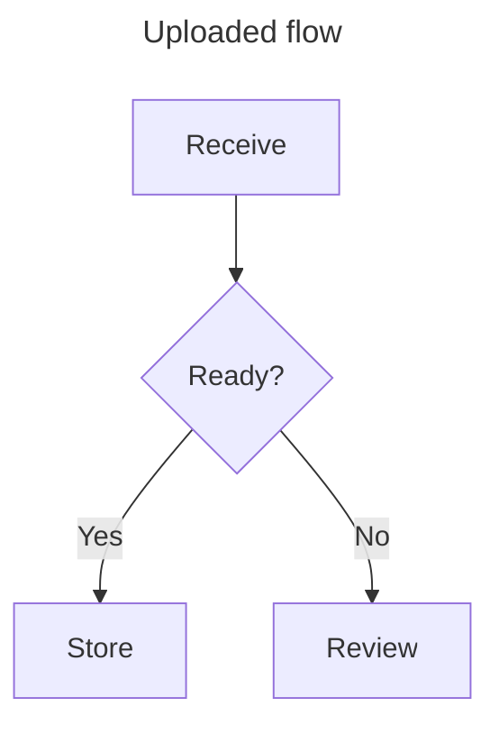
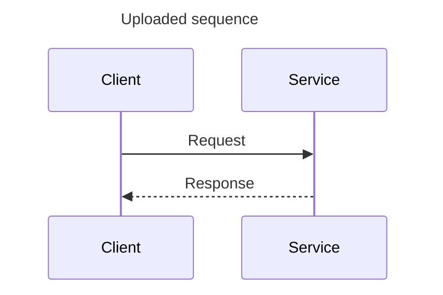

# Project documentation

The prose and non-Mermaid examples are not diagram source.

```text
This code block is not a diagram.
```


```mermaid
---
title: Uploaded flow
---
flowchart TB
  A[Receive] --> B{Ready?}
  B -->|Yes| C[Store]
  B -->|No| D[Review]
```

## Request exchange


```mermaid
---
title: Uploaded sequence
---
sequenceDiagram
  participant Client
  participant Service
  Client->>Service: Request
  Service-->>Client: Response
```
